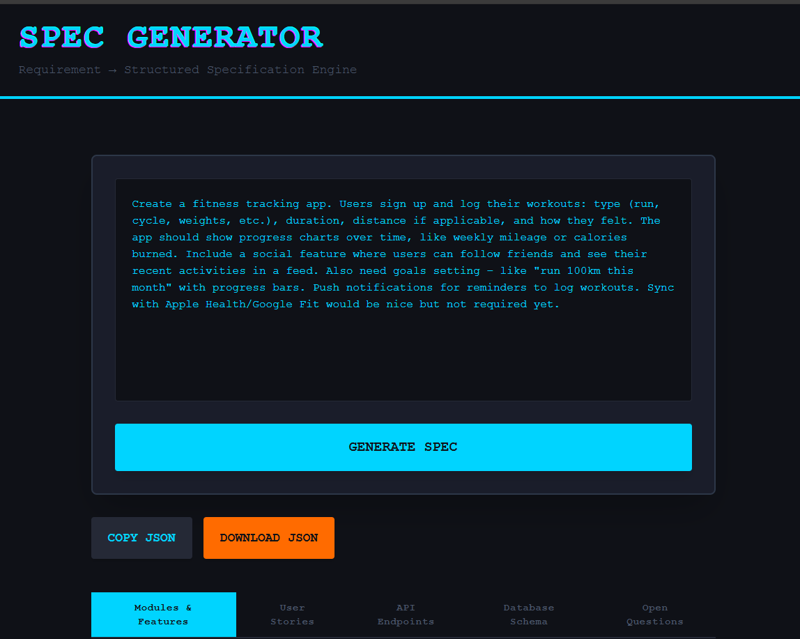
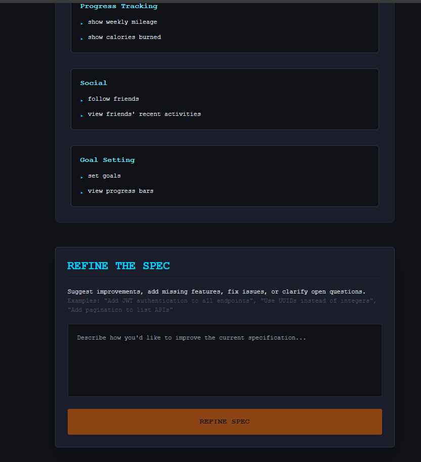

# Spec Generator

Specification generator copilot, a powerful, full-stack tool that transforms messy, unstructured product requirements into clean, structured technical specifications, complete with modules, user stories, API endpoints, database schema, and open questions.

Live Demo:  
Frontend: https://spec-generator-psi.vercel.app/  
Backend: https://saadajee-spec-gen.hf.space

### The Problem

Product requirements are often written in natural language, scattered, ambiguous, and inconsistent. Engineers waste hours interpreting vague descriptions, leading to misaligned implementations, missing features, and endless back-and-forth.

### How It Tackles It

Spec Generator uses a multi-step LLM pipeline to intelligently parse and structure requirements:
1. Extracts core modules and features
2. Generates detailed user stories
3. Designs RESTful API endpoints
4. Creates a normalized database schema
5. Identifies open questions and edge cases

It also supports iterative refinement, you can ask it to "add JWT auth", "use UUIDs", or "add pagination", and it updates the spec coherently while preserving structure.

### Technologies Used

| Layer     | Technology                          | Purpose                                      |
|-----------|-------------------------------------|----------------------------------------------|
| Frontend  | Next.js 16 (Pages Router)           | Full-stack React framework with SSR and routing |
| Frontend  | React 19                            | Component-based UI library                   |
| Frontend  | Tailwind CSS (custom  theme)        | Rapid, responsive styling with dark mechanical aesthetic |
| Frontend  | Headless UI                         | Unstyled, accessible components (e.g., tabs) |
| Frontend  | Axios                               | HTTP client for API calls to backend         |
| Frontend  | react-syntax-highlighter            | Colored syntax-highlighted JSON/code display |
| Backend   | FastAPI (Python)                    | High-performance API framework               |
| Backend   | Pydantic                            | Request validation and data modeling         |
| Backend   | Grok xAI API (custom structured prompts)| Core intelligence for parsing and structuring requirements |


### Features

- Clean, industrial-themed dark UI with glitch animations and glow effects
- Responsive design (fully mobile-friendly)
- Real-time generation with loading spinner
- Tabbed output: Modules & Features, User Stories, API Endpoints, Database Schema, Open Questions
- Syntax-highlighted JSON display for API/DB sections
- Export: Copy full spec or download as JSON
- Iterative refinement panel
- Rate limiting and trace ID tracking 
- Error handling (including short input validation)

### Screenshots

<div align="center">



*The main interface: Paste your product requirements into the textarea and click "GENERATE SPEC" to instantly create a structured specification. Also, tabbed output view: Clean, organized sections with syntax-highlighted JSON for API and database schemas.*



*The refinement panel: Iteratively improve the spec by typing suggestions like "Add JWT authentication" or "Use pagination".*

</div>

### Local Setup

1. Clone the repo:
  ```
  git clone https://github.com/Saadajee/spec-generator.git
  cd spec-generator
  ```
2. Start the backend:
  ```
  cd backend
  conda create -n specgen python=3.11  # or use venv
  conda activate specgen
  pip install -r requirements.txt
  uvicorn app.main:app --reload
  ```
  _Backend runs at [http://localhost:8000](http://localhost:8000)_ (You can change the model by going to pipeline.py and modify the function _llm_generate_ to change the LLM)
  
3. Start the frontend:
  ```
  cd frontend
  npm install
  npm run dev
  ```
  _Frontend runs at [http://localhost:3000](http://localhost:3000) (proxies to backend automatically)_

Open browser and start generating specs!

### Online Deployment

Frontend: You can modify the frontend and deploy on vercel, netlify or any platform of your choice.
Backend: Deployed on Hugging Face Spaces but can be deployed on railway or any platform of your choice.

Note: When the backend is fully connected, set NEXT_PUBLIC_BACKEND_URL="https://link-to-backend.com" in settings to enable live generation on the deployed frontend. And for backend go for the GROQ_API_KEY from grokapi and insert in on the backend deployment envirement setting.

### Notes
- Requires at least 50 characters for high-quality output
- Refinement maintains context using trace IDs for coherent iterations
- Easily extensible: swap LLM, add auth, export to Swagger/Postman

## Curator

📧 [saadimran7667@gmail.com](saadimran7667@gmail.com)
Happy to collaborate, debug, or help you extend the project further.

### Tidbits
* This tool started as a way to eliminate the most frustrating part of building software: miscommunication between ideas and implementation.
* It’s not perfect, but it gets remarkably close, and it keeps getting better with every refinement.
* Try it. Break it. Improve it. And may your specs be ever structured.
